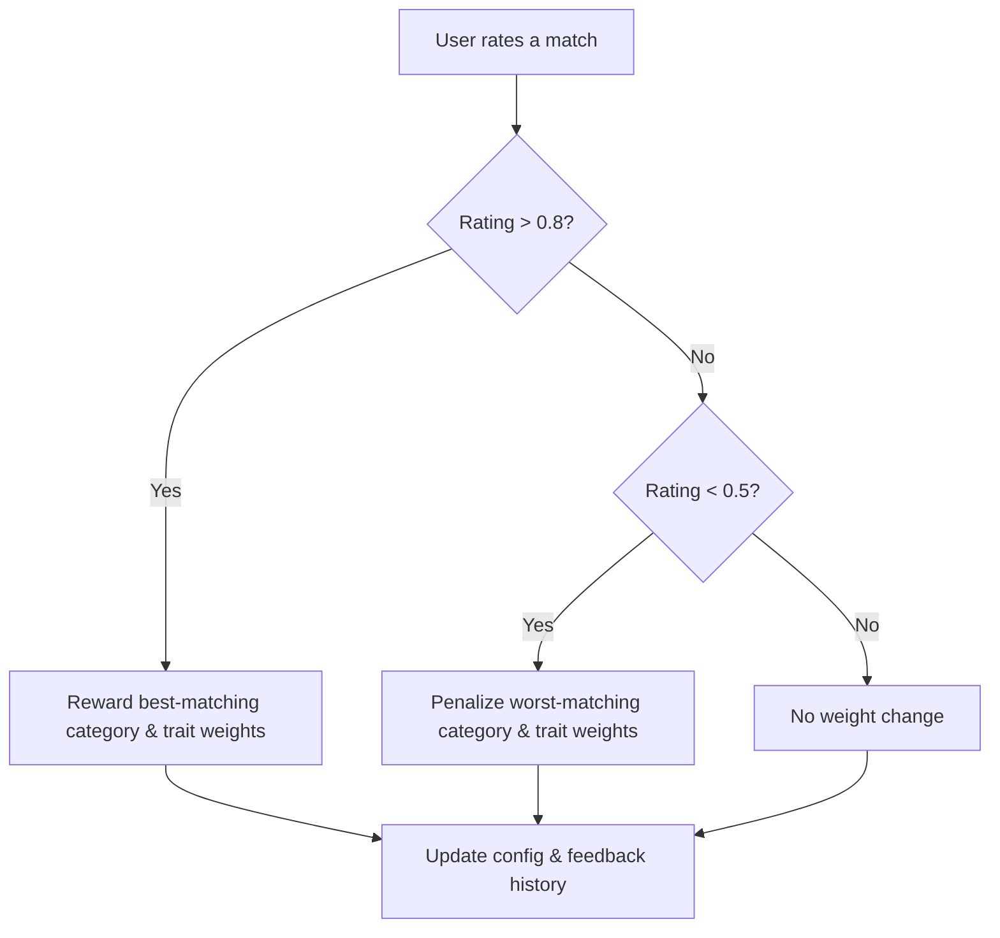
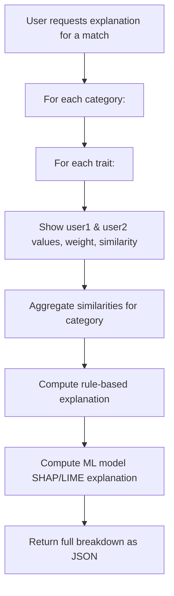

# UniMates Complex Matching Algorithm

## Overview
The UniMates complex matching algorithm is a dynamic, adaptive, and explainable system for matching users (e.g., roommates) based on a multi-dimensional questionnaire. It uses advanced similarity metrics, adaptive learning from user feedback, and provides transparent explanations for every match.

---

## Key Features
- **Multi-category trait scoring** (personality, habits, lifestyle, characteristics)
- **Weighted trait and category matching**
- **Cosine, Pearson, or Jaccard similarity** (configurable)
- **Cluster-based imputation for missing data**
- **User-specific preferences** (optional)
- **Adaptive learning**: weights are updated based on user feedback (positive and negative)
- **Explainable results**: breakdown of which traits/categories contributed most

---

## Main Matching Flow

```mermaid
graph TD;
    A[User submits profile & answers] --> B[Scores calculated for each trait/category];
    B --> C[User requests matches];
    C --> D[For each candidate:];
    D --> E[Impute missing traits (cluster-based)];
    E --> F[Calculate trait similarities (weighted, method from config)];
    F --> G[Aggregate by category (with user & global weights)];
    G --> H[Apply cross-trait penalties];
    H --> I[Compute rule-based compatibility score];
    I --> J[Compute ML model prediction using trained model];
    J --> K[Combine or select best score];
    K --> L[Return top matches with explanations];
```

---

## Adaptive Learning Flow



---

## Explanation Generation Flow



---

## Configuration
- All weights and similarity methods are set in `api/matching_config.json`.
- You can add new traits or categories by updating the config and adding new questions.
- The system adapts over time as users rate their matches.

---

## Endpoints
- `/find-matches`: Get best matches for a user.
- `/rate-match-dynamic`: Submit feedback (rating) for a match; triggers adaptive learning.
- `/explain-match`: Get a detailed explanation of a match between two users.

---

## Example: How a Match is Calculated
1. **Trait scores** are computed for each user from their answers.
2. **Missing traits** are imputed using the average of the most similar users (cluster-based).
3. **Trait similarities** are calculated using the selected metric (cosine, Pearson, Jaccard), weighted by trait importance.
4. **Category similarities** are aggregated, using both global and user-specific weights.
5. **Cross-trait penalties** are applied for known incompatibilities (e.g., sleep/noise).
6. **Final score** is returned, along with a breakdown of which categories/traits contributed most.

---

## Example: Adaptive Learning
- If a user rates a match poorly, the system penalizes the lowest-matching category and trait, reducing their influence in future matches.
- If a user rates a match highly, the system rewards the best-matching category and trait, increasing their influence.
- All feedback is stored for future analysis and further learning.

---

## Example: Explanation Output
```json
{
  "score": 0.82,
  "explanation": {
    "personality": {
      "similarity": 0.9,
      "traits": {
        "communication_style": {"user1": 2, "user2": 2, "weight": 1.1, "similarity": 1.0},
        "conflict_resolution": {"user1": 1, "user2": 1, "weight": 1.0, "similarity": 1.0}
      }
    },
    ...
  }
}
```

---

## How to Get Data for Training

To train the machine learning model for match prediction, you need a dataset of user pairs, their trait/category similarities, and the ratings (feedback) users have given for those matches. Here are the main ways to get this data:

### 1. Real User Data (Best Source)
- As users interact with your platform and rate their matches (using `/rate-match-dynamic` or `/trait-feedback`), feedback is stored in your backend.
- **How to export:**
  - Run the script:
    ```bash
    python api/export_feedback_data.py
    ```
  - This will generate `feedback_export.csv` in your `api/` directory, containing all features and ratings needed for ML training.

### 2. Synthetic Data (For Initial Testing)
- If you don't have enough real data, you can generate synthetic user profiles and simulated ratings.
- Create a script to generate random users, simulate matches, and assign plausible ratings (e.g., high for similar, low for opposites).
- This is useful for initial model development, but real data is always better for production.

### 3. Public Datasets (For Inspiration/Testing)
- There are no public datasets exactly like roommate matching, but you can look at:
  - Personality/compatibility datasets (e.g., from social science research, Kaggle, UCI ML Repository).
  - Survey datasets with multi-dimensional answers and compatibility/satisfaction labels.

### 4. Bootstrapping with Manual Ratings
- Ask a small group of users (friends, testers) to fill out the quiz and rate hypothetical matches.
- This can quickly give you a seed dataset to start training.

### 5. Continuous Data Collection
- As your platform grows, keep collecting feedback and trait ratings.
- Periodically re-export and retrain your model for improved accuracy.

---

## How to Extend
- Add new traits/categories in the config and questionnaire.
- Adjust weights or similarity method in `matching_config.json`.
- Use the `/rate-match-dynamic` endpoint to let the system learn from real user feedback.
- Use `/explain-match` to debug or visualize why matches are strong or weak.

---

## Machine Learning Model Integration

The UniMates matching system uses a hybrid approach: a rule-based algorithm (with adaptive weights and explainability) and a machine learning (ML) model trained on real user feedback. The ML model can learn complex, non-linear relationships between user traits and match outcomes, improving accuracy as more data is collected.

### How it Works
1. **Data Export:**
   - Use `export_feedback_data.py` to export user match feedback and trait similarities to `feedback_export.csv`.
2. **Model Training:**
   - Use `train_match_model.ipynb` to train a regression model (e.g., Random Forest) to predict match ratings from trait/category similarities.
   - The model is saved as `match_model.pkl`.
3. **Model Loading & Prediction:**
   - The backend loads the model using `ml_model_loader.py`.
   - For each candidate match, the system computes features and predicts match quality using the ML model.
4. **Hybrid Scoring:**
   - The ML model's prediction can be used as the final compatibility score, or combined with the rule-based score for robust matching.
5. **Explainability:**
   - SHAP or LIME is used to explain the ML model's predictions for any match, showing which features (traits/categories) contributed most.

---

## Updated Main Matching Flow

```mermaid
graph TD
A[User submits profile & answers] --> B[Scores calculated for each trait/category]
B --> C[User requests matches]
C --> D[For each candidate]
D --> E[Impute missing traits (cluster-based)]
E --> F[Calculate trait similarities (weighted, method from config)]
F --> G[Aggregate by category (with user & global weights)]
G --> H[Apply cross-trait penalties]
H --> I[Compute rule-based compatibility score]
I --> J[Compute ML model prediction using trained model]
J --> K[Combine or select best score]
K --> L[Return top matches with explanations]
```

---

## Adaptive Learning Flow


---

## Updated Explanation Generation Flow

